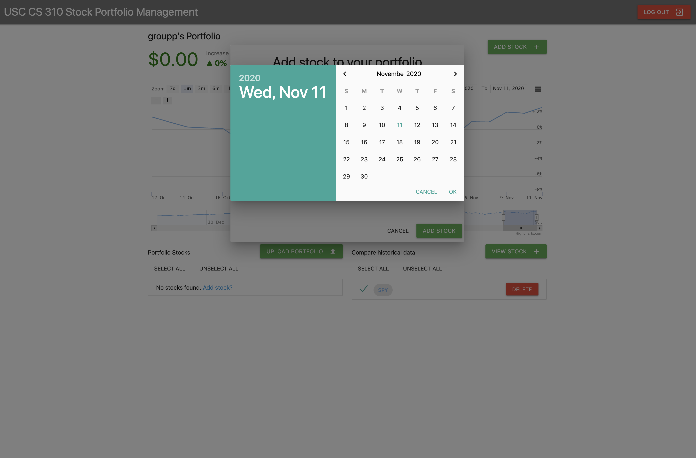

# Stock Portfolio -- csci310 groupp
A web application that can help users track the value of their stock portfolio over time and make investment decisions.

## Features
1. **Prediction** of future values of the portfolio.
2. Ability to **add or remove stocks** from the portfolio.
3. Track and **visualize changes** in value over time of user’s portfolio.
4. View and compare the **historical** performance of a stock.
5. Works on the Chrome web browser and **mobile** devices.
6. The application is **secure** and protect confidentiality of users’ data.(eg. using https/auto log out after 120 idle secs)
7. Users are able to create an account in the system.
8. User interfaces look modern and is attractive.
9. Users can **upload** their previous stock information via csv file upload.
10. Bug free: Selenium tests for every feature and 100% coverage on all backend files.

## Screenshots
                                            
             
 
 
 

## Project contributor
Yulun Zhang, Jincheng Zhou, Zixuan Li, Yang Li, Changyu Zhu
